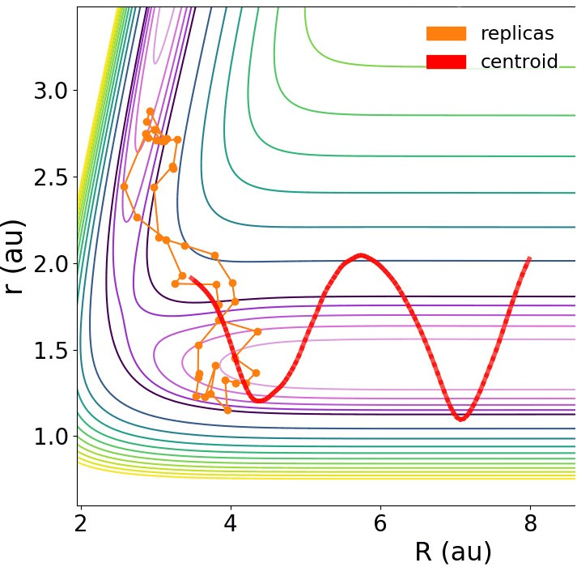
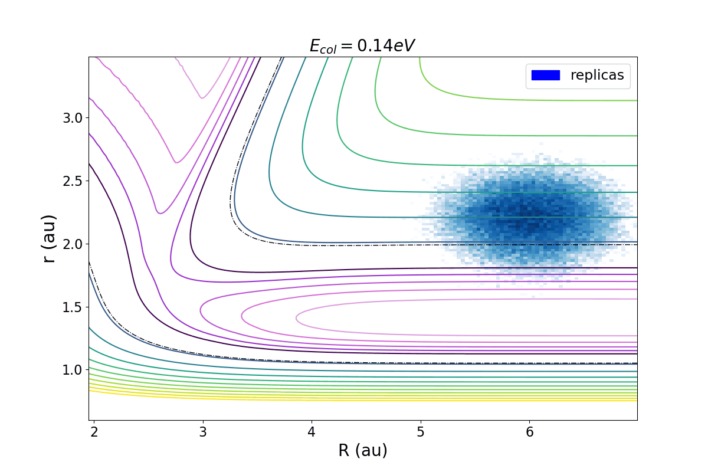

# WORK in PROGRESS
Currently revamping it to be more modular and applicable.

# Phase-space-density-visualisator
Program which can display dynamically the 2D density plot of the phase space coordinates for collisions in trimatomic systems.
Currently revamping it for applicability

# Example outputs 

 

