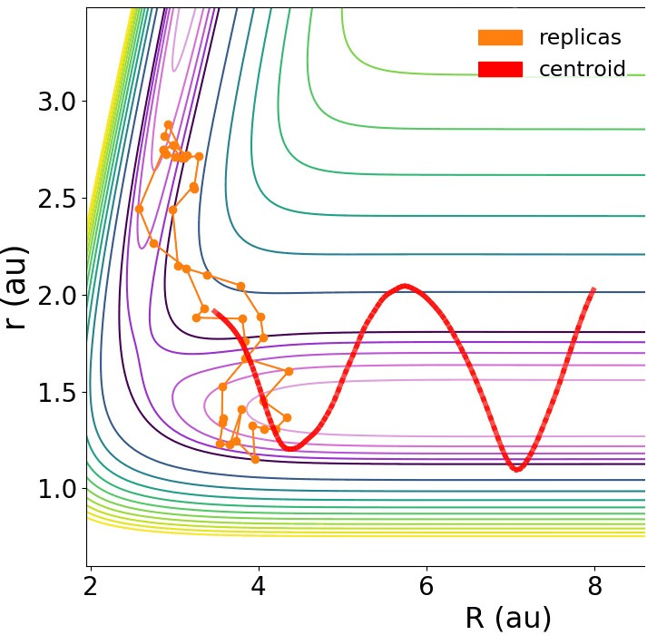

# WORK in PROGRESS
Currently revamping it to be more modular and applicable.
# Phase-space-density-visualisator
Program which can display dynamically the 2D density plot of the phase space coordinates.
Currently revamping it for applicability

# Developed in Python 3.9. Dependencies: 

Numpy, scipy, matplotlib, mplt_toolkits, sympy, imageio, shutil, sys, os.

# Possible outputs 

